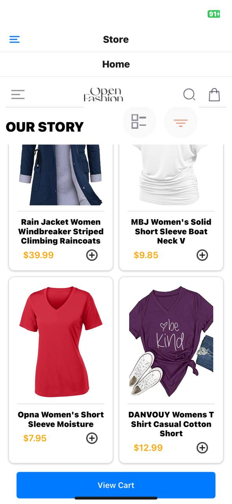
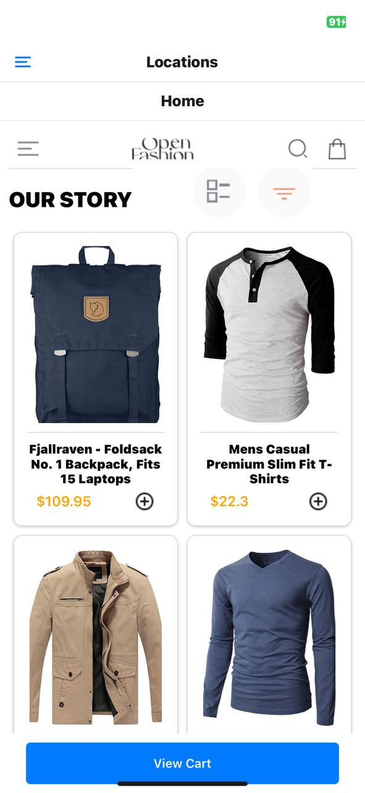

# FAKE STORE APP

# Features

## HomeScreen

Displays a product list fetched from an external API, with an "Add to Cart" button for each item.

## ProductDetailScreen

Provides detailed information about a selected product.

## CartScreen

Shows the items added to the cart, allowing users to remove items if needed.

## Drawer Navigation

Offers easy access through a drawer menu, available via a button or swipe gesture.

## Data Storage

Employs AsyncStorage for local storage and retrieval of cart items.

## Design Choices

### User Experience

The app is designed for a simple and user-friendly experience. Products are displayed in a grid format for easy browsing, with each product card including an image, title, and price for quick reference.

## Navigation

Uses React Navigation for screen transitions. A stack navigator is used for primary screens (Home, Product Detail, Cart), and a drawer navigator provides additional navigation options.

## State Management

Relies on React's useState and useEffect hooks for state management and handling side effects, simplifying data flow and enhancing code maintainability.

## Local Storage

AsyncStorage is chosen for persistent data storage, ensuring that cart data is retained even if the app is closed or the device is restarted due to its simplicity and seamless integration with React Native.

## Data Storage Implementation

### AsyncStorage

Cart items are stored locally using AsyncStorage. When an item is added to the cart, the app fetches the current cart from AsyncStorage, updates it with the new item, and saves it back. Similarly, removing an item updates the stored cart.

## Data Retrieval

On startup, the app loads cart data from AsyncStorage to restore the user's cart state. This is achieved through an asynchronous function that reads the cart data from storage and updates the app's state.

## Usage

### HomeScreen

Browse products and add them to the cart.

### ProductDetailScreen

View detailed information about a product by selecting it on the HomeScreen.

### CartScreen

View and manage items in the cart.

### Drawer Navigation

Access additional navigation options via the drawer menu.

# Setup

- Clone the repository.
- Install dependencies with npm install or yarn install.
- Run the app on a simulator or physical device using npx react-native run-android or npx react-native run-ios.

# SCREENSHOTS

